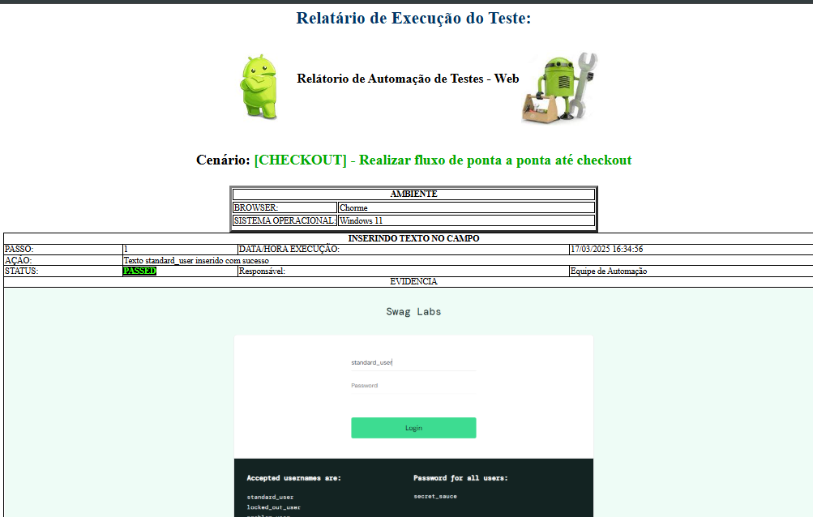
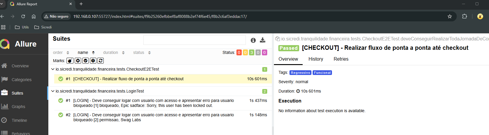

# PROVA TECNICA AUTOMAÇÃO DE TESTES E2E

## Automação de testes
Projeto com objetivo de demostrar as minhas habilidades com automação de testes E2E, utilizando tecnicas e boas práticas de testes com o uso do ‘Framework’ Selenium/Selenide. 
O projeto possui uma arquitura Page Object Pattern possibilitando uma melhor organizaçâo do teste separando os locators do codigo. .
Para o relatorio foi implementado um report que faz a captura da tela evidenciando os passos do teste e no final montar um relario com as evidências em HTML.

https://gitlab.com/rodrigo.qa/outsera-automation-web-test

### Pré-condições

Para execução do projeto, é necessário possuir as seguintes instalações na máquina:
- Java 17 ou superior;
- Maven.

### Executando o projeto
Após atender as pré-condições, executar o comando `mvn install` para baixar as dependências;

Para executar os testes, executar o comando: `mvn test`.

Também é possível executar por tags: `mvn test  -Dgroups= "<tag(s)>"`

### Tags

- login
- checkout

### Estrutura dos testes

#### Main
- **setup:** Contém as configurações basicas do teste, todas classes de Teste devem extende-la;
- **utils:** Contém classes auxiliares que ajudam na construção dos testes, constantes, reporte etc.

#### Test
- **action:** Contém os metodos responsaveis pela iteração com a página.
- **screen:** Contém os locators 
- **testes:** Contém as classes de testes 

### CI/CD

#### gitlab.ci
Foi implementado uma soluçâo para rodar os testes utilizado o CI do gitlab.ci. 
Os testes seram executados por meio do servidor do selenium Grid.

#### Relatório HTML

Após a execução dos testes é possível gerar o relatório personalizado feito em html o mesmo contem todos os passos evidenciados por imagems e descrição dos passos. 
 
 -> evidencias 
 -> relatorio 
 -> yyyy-MM-dd 
 -> nometeste.html .
Para abrir basta clicar com o botão direito e selecionar qual navegador deseja visualizar. 

#### Report Allure

Após a execução dos testes é possível gerar o relatório com a biblioteca Allure, e desta forma, visualizar os resultados de forma mais simplificada.
Para visualizar o relatório,  
basta executar o comando: `mvn allure:serve`

